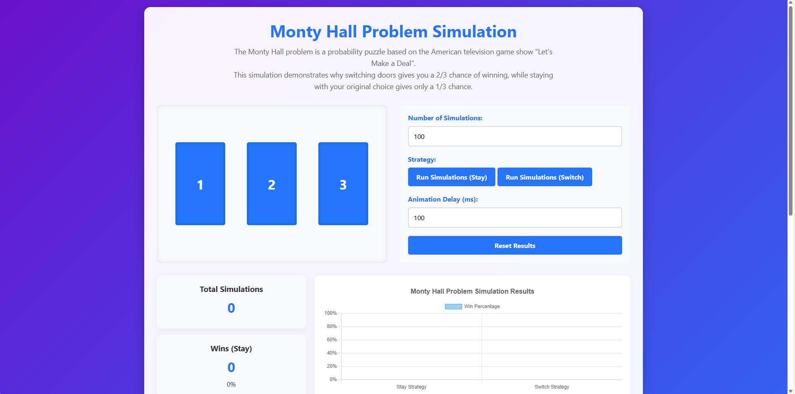
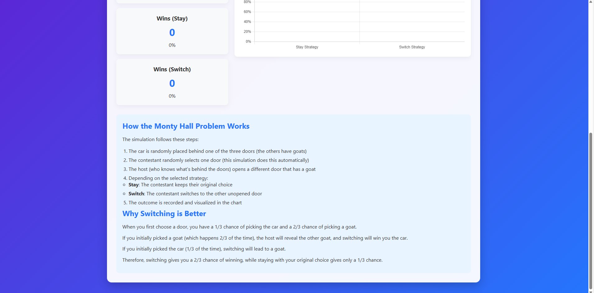
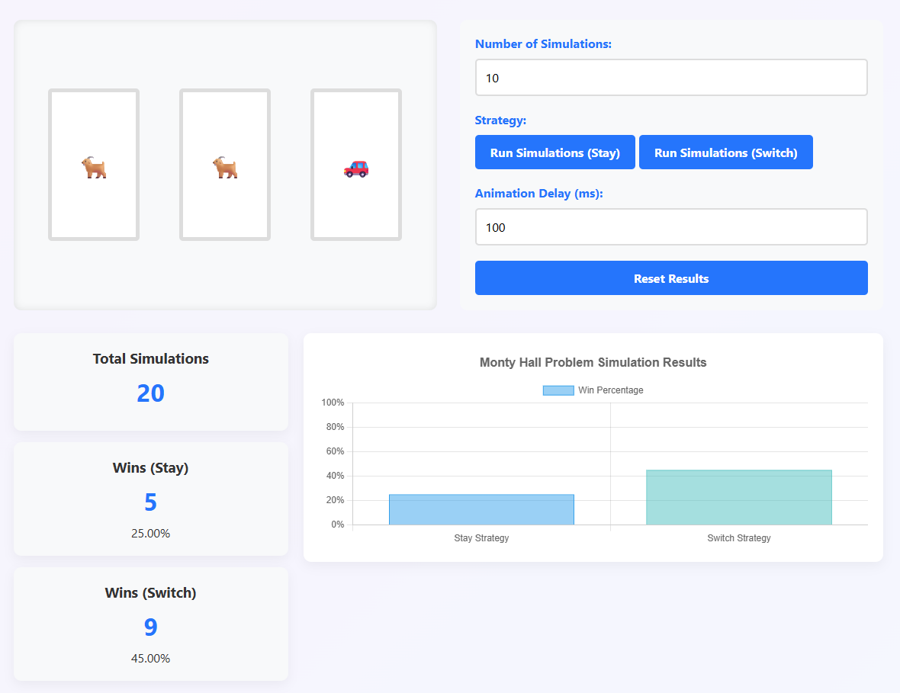

📖 Overview
The Monty Hall Problem is a famous probability puzzle based on the American television game show "Let's Make a Deal". This interactive web application provides a visual simulation to demonstrate the counterintuitive solution to this classic problem.

Live Demo: Monty Hall Simulation

## 🎥 Demo
Main Page

🧠 The Problem
In the Monty Hall problem:

There are three doors: one hiding a car (prize) and two hiding goats

The contestant selects one door

The host (who knows what's behind each door) opens another door, always revealing a goat

The contestant is given the choice to either stick with their original selection or switch to the remaining unopened door

The paradox: switching doors gives you a 2/3 chance of winning, while staying with your original choice gives only a 1/3 chance.

✨ Features
🎯 Interactive Simulation
Visual door selection with smooth animations

Real-time simulation with adjustable speed

Both "stay" and "switch" strategy implementations

📊 Data Visualization
Real-time statistics tracking

Interactive chart showing win percentages

Cumulative results across multiple simulations

⚙️ Customization Options
Adjustable number of simulations (1-1000)

Configurable animation delay

Reset functionality for clean testing

🚀 Getting Started
Prerequisites
Modern web browser with JavaScript enabled

Internet connection (for Chart.js CDN)

Installation
Clone or download the project files

Open index.html in your web browser

No server required - runs directly in the browser

Usage
Select the number of simulations to run

Adjust animation speed if desired

Click "Run Simulations (Stay)" to test the stay strategy

Click "Run Simulations (Switch)" to test the switch strategy

Observe the results in the statistics panel and chart

🏗️ Technical Architecture
Frontend Technologies
HTML5: Semantic structure and accessibility

CSS3: Modern styling with gradients, flexbox, and animations

JavaScript ES6+: Simulation logic and interactivity

Chart.js: Data visualization for results

📈 Performance Considerations
The simulation can run up to 1000 iterations efficiently

Animation delays are customizable to balance visual clarity vs speed

Chart.js provides optimized rendering for data visualization

🧪 Testing Strategies
For accurate results:

Run at least 100 simulations per strategy

Compare the win percentages between strategies

Reset between strategy tests for clean comparisons

Notice how the switch strategy consistently approaches 66.7% success rate

